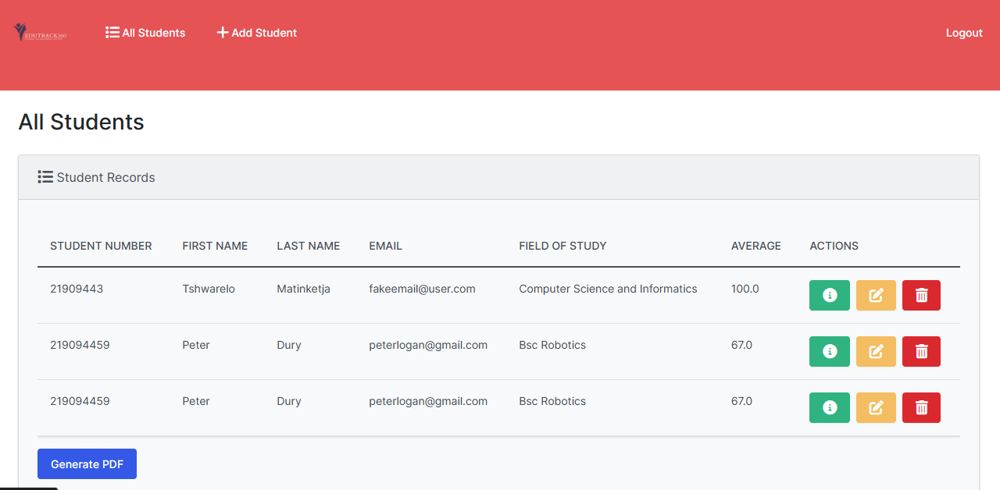

# EduTrack360
<<<<<<< HEAD

Student Management System is a Django web application designed to manage student records. It allows users to add, view, edit, and delete student information through a user-friendly interface.

## Features

- **Add Student:** Users can add new students by providing their student number, first name, last name, email, field of study, and average GPA.
- **View Students:** All added students are displayed in a table format, providing an overview of their information.
- **Edit Student:** Users can edit existing student records, updating their details as needed.
- **Delete Student:** Students can be deleted from the system, removing their information from the database.
- **PDF Generation:** Users can generate a PDF document containing a list of all students and download it for offline reference.

## Installation

1. Clone the repository:


## Table of Contents 
- [Prerequisites](#prerequisites)
- [Installation](#installation)
- [Run the application](#run-the-application)
- [View the application](#view-the-application)
- [Copyright and License](#copyright-and-license)


### Prerequisites

Install the following prerequisites:

1. [Python 3.8-3.11](https://www.python.org/downloads/)
<br> This project uses **Django v4.2.4**. For Django to work, you must have a correct Python version installed on your machine. More information [here](https://django.readthedocs.io/en/stable/faq/install.html).
2. [Visual Studio Code](https://code.visualstudio.com/download)


### Screenshots




### Installation

#### 1. Create a virtual environment

From the **root** directory, run:

```bash
python -m venv venv
```

#### 2. Activate the virtual environment

From the **root** directory, run:

On macOS:

```bash
source venv/bin/activate
```

On Windows:

```bash
venv\scripts\activate
```

#### 3. Install required dependencies

From the **root** directory, run:

```bash
pip install -r requirements.txt
```

#### 4. Run migrations

From the **root** directory, run:

```bash
python manage.py makemigrations
```
```bash
python manage.py migrate
```

#### 5. Create an admin user to access the Django Admin interface

From the **root** directory, run:

```bash
python manage.py createsuperuser
```

When prompted, enter a username, email, and password.

### Run the application

From the **root** directory, run:

```bash
python manage.py runserver
```

### View the application

Go to http://127.0.0.1:8000/ to view the application.

### Copyright and License

Copyright © 2022 Bob's Programming Academy. Code released under the MIT license.
=======
EduTrack360 is a Django web application designed to manage student records efficiently. It allows users to add, view, edit, and delete student information through a user-friendly interface. The project features PDF generation functionality, enabling users to generate and download a PDF document containing a list of all students.
>>>>>>> 847197494aa7f69664297bb885f5f4565c64e5af
